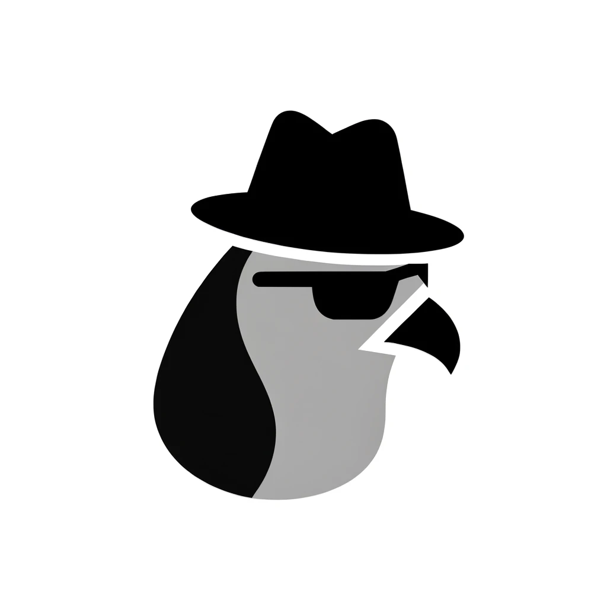

# Superpygeon 🔥

*"See beyond the ordinary, infer the extraordinary"* 

A comprehensive computer vision inference engine supporting multiple features and use cases for image detection, classification, segmentation, and recognition - all in one unified platform 🎯.

## 🚀 Features

Superpygeon offers a comprehensive suite of computer vision features:

### 📊 Analytics Features
- **Attendance** - Monitor region occupancy during specified time intervals
- **Dwell Time** - Track how long objects stay in designated areas
- **Meeting Detection** - Identify meetings based on participant count and duration
- **Overtime Monitoring** - Alert when objects exceed allowed time thresholds
- **Region Counting** - Count specific object types in defined areas
- **Crowd Monitoring** - Monitor crowd violations based on occupancy thresholds
- **Line Counting** - Detect and count objects crossing defined lines with directional support
- **Object Violation** - Monitor spatial relationships between objects for safety compliance

### 🛠️ Technical Features
- **Multi-camera Support** - Process multiple video streams simultaneously
- **Real-time Processing** - Low-latency inference and analysis
- **Docker Deployment** - Easy containerized deployment
- **Configurable Pipeline** - Visual configuration builder for easy setup
- **RTSP/WebRTC Streaming** - Multiple output formats
- **Scalable Architecture** - Microservices-based design

For detailed feature documentation and parameters, see **[Features Documentation](docs/feature.md)**.

## 📖 Documentation

- **[Installation Guide](docs/installation.md)** - Complete setup instructions and troubleshooting
- **[Features Documentation](docs/feature.md)** - Detailed feature explanations and parameters  

## 🔧 Configuration

Superpygeon uses YAML configuration files to define camera sources, detection regions, feature parameters, and output settings.

Use the [Config Builder](https://github.com/Kecilin-Team/spy-config-builder) for visual configuration creation.

---

Made with ❤️ by the AssistX Computer Vision Team

